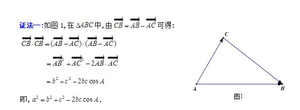

呵，脑子？这东西从来就没有过。

> 
看到个余弦距离，表示一脸懵逼
接着就是非要证明一下余弦定理。
but最后只看懂百度给的用向量证明
然后觉得，应该做一下向量的功课：

 

==========

* 1、向量的加法满足平行四边形法则和三角形法则.
    > 向量的加法OB+OA=OC.
    a+b=(x+x',y+y').
    a+0=0+a=a.
    向量加法的运算律：
    交换律：a+b=b+a； 
    结合律：(a+b)+c=a+(b+c).

* 2、向量的减法
    > 如果a、b是互为相反的向量,那么a=-b,b=-a,a+b=0.0的反向量为0 
向量的减法
AB-AC=CB.即“共同起点,指向被 
向量的减法减” 
a=(x,y)b=(x',y') 则a-b=(x-x',y-y').

* 3、数乘向量
    > 实数λ和向量a的乘积是一个向量,记作λa,且∣λa∣=∣λ∣·∣a∣.
当λ＞0时,λa与a同方向； 
向量的数乘
当λ＜0时,λa与a反方向； 
向量的数乘当λ=0时,λa=0,方向任意.
当a=0时,对于任意实数λ,都有λa=0.
注：按定义知,如果λa=0,那么λ=0或a=0.
实数λ叫做向量a的系数,乘数向量λa的几何意义就是将表示向量a的有向线段伸长或压缩.
当∣λ∣＞1时,表示向量a的有向线段在原方向（λ＞0）或反方向（λ＜0）上伸长为原来的∣λ∣倍； 
当∣λ∣＜1时,表示向量a的有向线段在原方向（λ＞0）或××反方向（λ＜0）上缩短为原来的∣λ∣倍.
数与向量的乘法满足下面的运算律 
结合律：(λa)·b=λ(a·b)=(a·λb).
向量对于数的分配律（第一分配律）：(λ+μ)a=λa+μa.
数对于向量的分配律（第二分配律）：λ(a+b)=λa+λb.
数乘向量的消去律：① 如果实数λ≠0且λa=λb,那么a=b.② 如果a≠0且λa=μa,那么λ=μ.

* 4、向量的数量积
    > 定义：已知两个非零向量a,b.作OA=a,OB=b,则角AOB称作向量a和向量b的夹角,记作〈a,b〉并规定0≤〈a,b〉≤π 
定义：两个向量的数量积（内积、点积）是一个数量,记作a·b.若a、b不共线,则a·b=|a|·|b|·cos〈a,b〉；若a、b共线,则a·b=+-∣a∣∣b∣.
向量的数量积的坐标表示：a·b=x·x'+y·y'.向量的数量积的运算律 
a·b=b·a（交换律）； 
(λa)·b=λ(a·b)(关于数乘法的结合律)； 
（a+b)·c=a·c+b·c（分配律）； 
向量的数量积的性质 
a·a=|a|的平方.
a⊥b 〈=〉a·b=0.
|a·b|≤|a|·|b|.（该公式证明如下：|a·b|=|a|·|b|·|cosα| 因为0≤|cosα|≤1,所以|a·b|≤|a|·|b|） 
向量的数量积与实数运算的主要不同点 
1、向量的数量积不满足结合律,即：(a·b)·c≠a·(b·c)；例如：(a·b)^2≠a^2·b^2.
2、向量的数量积不满足消去律,即：由 a·b=a·c (a≠0),推不出 b=c.
3、|a·b|≠|a|·|b| 
4、由 |a|=|b| ,推不出 a=b或a=-b.

* 5、向量的向量积
    > 定义：两个向量a和b的向量积（外积、叉积）是一个向量,记作a×b（这里并不是乘号,只是一种表示方法,与“·”不同,也可记做“∧”）.若a、b不共线,则a×b的模是：∣a×b∣=|a|·|b|·sin〈a,b〉；a×b的方向是：垂直于a和b,且a、b和a×b按这个次序构成右手系.若a、b共线,则a×b=0.
向量的向量积性质：
∣a×b∣是以a和b为边的平行四边形面积.
a×a=0.
a垂直b〈=〉a×b=|a||b|.
向量的向量积运算律 
a×b=-b×a； 
（λa）×b=λ（a×b）=a×（λb）； 
a×（b+c）=a×b+a×c.
注：向量没有除法,“向量AB/向量CD”是没有意义的.